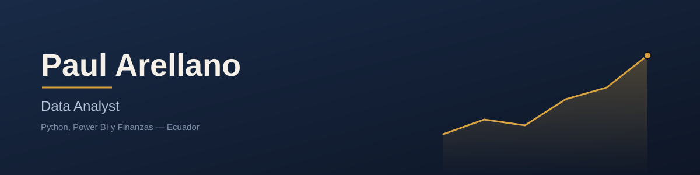

<h1 align="center">Hola 👋, soy Paul Arellano</h1>
<h3 align="center">Estudiante de Ingeniería en Sistemas de Información construyendo su camino en Data Analytics</h3>

  

## 🧭 Sobre mí

- 🎓 Estudiante de Ingeniería en Sistemas de Información, en transición hacia el análisis de datos.
- 📊 Trabajo con Python, Excel, Power BI y análisis financiero aplicado a escenarios de negocio.
- ⚙️ Mi diferencial: entiendo cómo se construyen los sistemas que generan los datos, no solo cómo analizarlos — eso me da una perspectiva distinta para diseñar pipelines y dashboards que realmente funcionan en producción.
- 📍 Basado en Ecuador, abierto a oportunidades en Ecuador y LatAm.
- 🚀 Actualmente construyendo mi portafolio con proyectos de análisis de datos aplicados a finanzas, ventas y retail.

## 🌐 Conecta conmigo

  

## 🛠️ Stack técnico

<table align="center">
  <tr>
    <td><b>Análisis de datos</b></td>
    <td>
      
      
      
      
      
    </td>
  </tr>
  <tr>
    <td><b>BI y reporting</b></td>
    <td>
      
      
    </td>
  </tr>
  <tr>
    <td><b>Finanzas</b></td>
    <td>
      
      
    </td>
  </tr>
  <tr>
    <td><b>Ingeniería y sistemas</b></td>
    <td>
      
      
      
    </td>
  </tr>
</table>

## 📊 Estadísticas de GitHub

  
  

